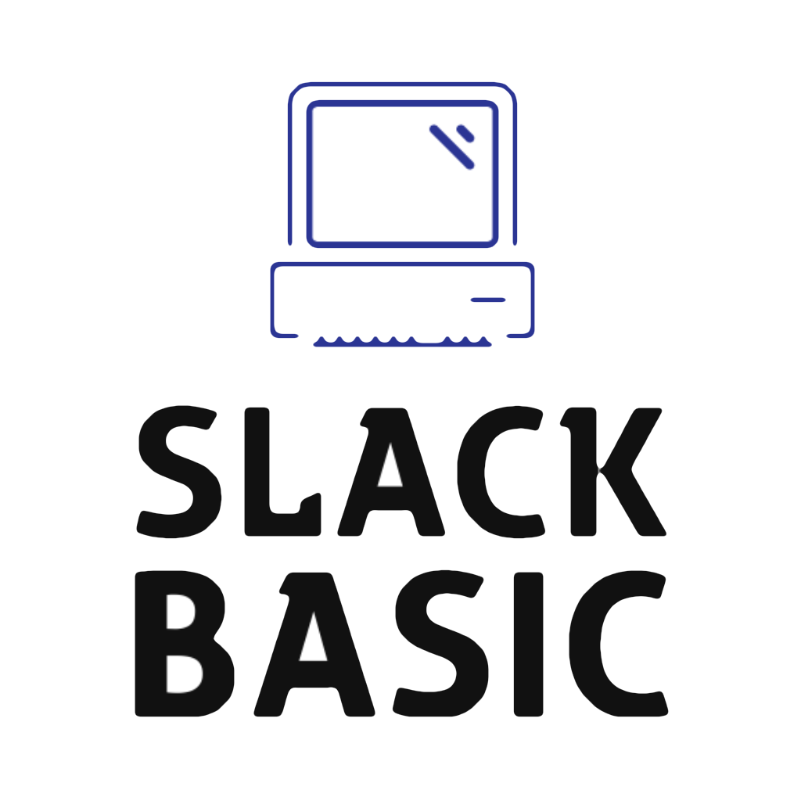

# Slack Basic



Your wildest dreams have come true. Finally, a Commodore 64 Basic 2.0 interpreter for slack.

## Running

After cloning and installing dependencies, you'll need a `.env` file with a few environment variables
to specify your slack team. You can use the included `manifest.json` file to add the app to your slack team.

```
SOCKET=true
APP_TOKEN=<<app token here>>
BOT_TOKEN=<<bot token here>>
SIGNING_SECRET=<<signing secret here>>
```

> Note: The App Token should have the `connections:write` permission.

Once complete, you can use `npm run dev` to run your server locally.

## REPL

A simple REPL is provided so that you can test the basic interpreter without going through slack. Use `npm run repl` to start it up.

## Tests

Run the tests by running Jest.

```shell
npx jest
```
